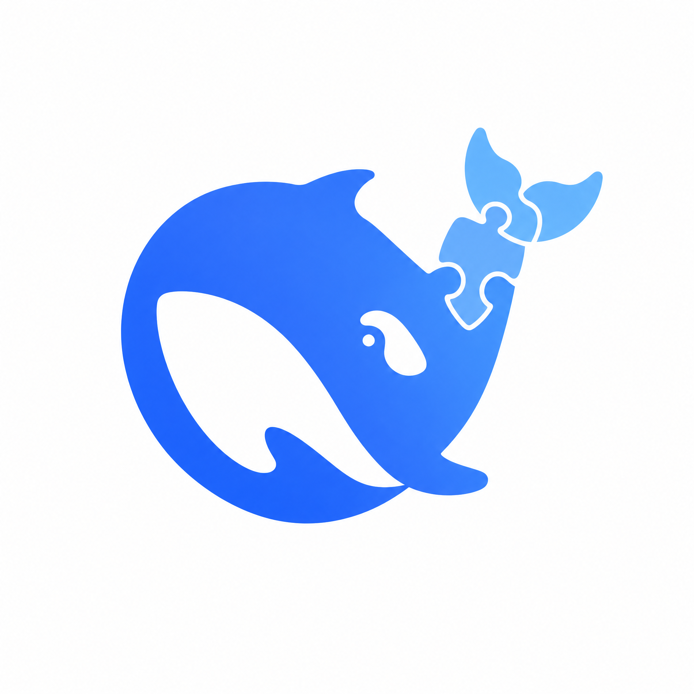

<p align="center"></p>

# Dude

Dude 是 [DeepSeek Harness](https://github.com/deepseek-ai/deepseek-harness)（`dsh`）的 macOS 桌面版。

dsh 官方提供的是命令行和浏览器里的 web 界面。Dude 把这套官方界面原样装进一个原生窗口：
双击就能用，不用开终端、不用记端口。

## 定位

- **界面全是官方的。** 左栏、会话、右栏、设置都来自官方 `dsh-web-app`，Dude 一行不改。
  官方有的功能 Dude 都有；官方没有的，等官方升级补上，Dude 不自己另画一套。
- **Dude 只补桌面窗口需要的东西。** 拖动窗口的区域和给 macOS 红绿灯留的位置，
  靠一段样式表实现。这是 Dude 唯一的界面代码。
- **自带内核，一键升级。** app 里带着一份 dsh 运行时（内核），装好就能用。官方发了新版，
  点菜单 **Dude → 检查内核更新…** 就能在 app 里升级，不用重装。新内核起不来会自动退回原来的版本。
- **数据和官方分开。** Dude 的设置、凭据和会话放在 `~/.dude`。第一次启动时从官方的
  `~/.dsh` 复制一份过来，之后两边互不影响。

## 安装

目前没有发布好的安装包，需要自己构建（macOS，Apple Silicon）：

```sh
pnpm install
pnpm --filter dude-desktop build
open apps/desktop/dist/Dude-0.1.0-arm64.dmg   # 把 Dude 拖进「应用程序」
```

## 开发

仓库结构：

| 目录 | 内容 |
|---|---|
| `apps/desktop/` | Electron 壳：窗口、启停 dsh、内核热更新 |
| `plugins/dude/` | Dude 插件：拖拽区域样式表 |
| `scripts/` | `dude` 启动器、`sync-upstream.mjs` 官方版本同步 |
| `design/` | 现行设计文档 |

开工前先读 [`AGENTS.md`](AGENTS.md)，它列了约束和阅读顺序。本地开发的起法见
[`apps/desktop/README.md`](apps/desktop/README.md)；仓库锁定的官方版本用
`node scripts/sync-upstream.mjs --apply` 升级（会自动跑测试和冒烟，失败自动回滚）。
